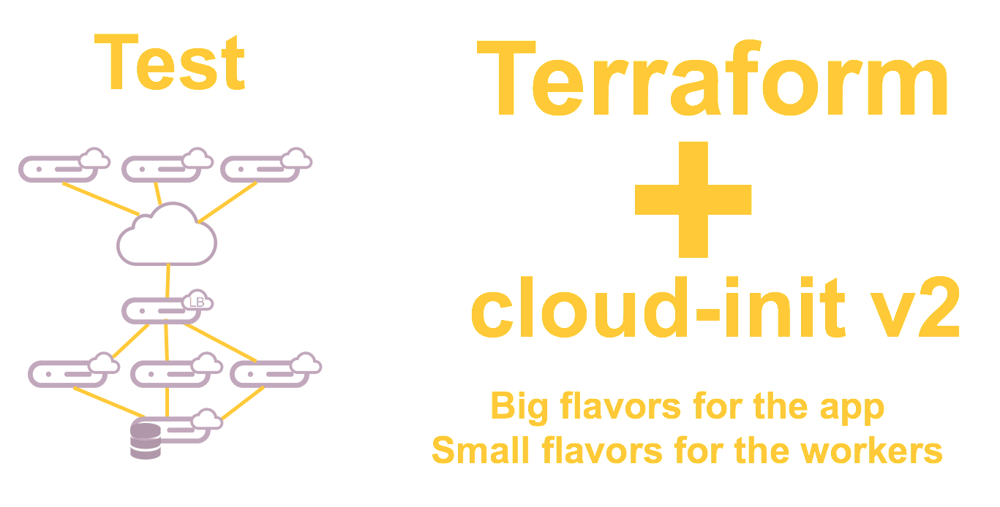

We'll use an orchestration tool called Terraform. This open source tool from Hashicorp is often used to manage cloud infrastructures. It has an OpenStack driver offering the possibility to speak directly to the APIs and stay standard.

# Target Infrastructure

We still have the backend server with NFS and MySQL to serve data to the 3 frontwebs. In front of the frontwebs, we have a load balancer routing the HTTP requests to the frontwebs.

As we want to run tests, we'll also create some servers to run Apache JMeter. It works with one master and many injectors to load the tested infrastructure.



# Exercise

In this exercise we'll see how Terraform works and what its syntax is. We'll also reuse the cloud-init we had in the 0.dev environment and we'll improve it to add the load balancing capability.

You have some files missing parts and you'll have to complete them. Those parts are **in bold** in the following text and some explanations are given to help you complete it and make it working. Take time to look how each sections of the files are built.

## main.tf

This is the orchestration for the whole environment in Terraform syntax. The main instructions are in "stress" and "app" modules, called from here.

This file contains, in order:

  * An OpenStack provider taking its configuration from environment variables
  * **A keypair resource**
    * This is one of the simplest resources, it creates an OpenStack keypair pushing your user's public key
    * Add those lines between provider "openstack" and module "app"
      ```
      resource "openstack_compute_keypair_v2" "gw" {
        name = "gw"
        public_key = "${file("~/.ssh/id_rsa.pub")}"
      }
      ```
  * A module "app"
    * The source code is outside our 1.test folder to be shared with other potential environments when it's needed
    * Some variables are defined
  * A module "stress" similar to "app"

> If in doubt, you can have a look at the file main.tf
>
> If you are really lost, just copy the main.tf to main.tf
> ```bash
> cp main.tf main.tf
> ```

## The stress module

The stress tests run on a JMeter infrastructure made of a master and many workers. The master can distribute its jobs to the workers called "injectors" here. The master needs to know the injectors' addresses in a central configuration file.

We'll start by booting the master, then each injector will annouce their own address to the master configuration file using SSH. So, the injectors should know the master address to connect to. An SSH keypair need to be installed, the private part will be shared by all the injectors to connect to the master which will authorize those connections with the public part of the SSH key pair.


### ../terraform-modules/stress/main.tf

This is the stress resources orchestration. It's the occasion to see some simple definitions of resources.

This file contains, in order:

  * Some variables
  * A "stress-master" instance
    * Some definitions
    * The nework definition of Ext-Net
    * A local-exec provisioner creating the keypair localy
    * A file provisioner which send a file into the instance
    * A remote-exec provisioner which executes commands into the created instance
      * Here we install the SSH public key part
    * **The user_data definition**
      * This is the location of the cloud-init file
      * Before the end of this resource section, add this line:
        ```
          user_data = "${file("${path.module}/master.yaml")}"
        ```
  * A "stress-injector" resource
    * **A dependency definition**
      * The injectors need to know the master is active so they can connect. We'll define a dependancy like that:
        ```
          depends_on      = ["openstack_compute_instance_v2.stress-master"]
        ```
    * A number of instances started from this template defined by the special "count" variable
    * A name including a number based on the count variable
    * Some definitions
    * A file provisioner which sends a file to the instance
    * A remote-exec provisioner which executes commands on the instance created
      * Here we install the SSH private key part
    * A user_data definition
    * **A metadata section**
      * We'll use it to provide the master's ip address to the injectors
      * This information will be available on the private meta-data server, reachable only from this instance
      * We'll be able to get this information from inside the instance and we'll do it in the injector.yaml
      * Here add those lines:
        ```
          metadata {
            master = "${openstack_compute_instance_v2.stress-master.access_ip_v4}"
          }
        ```

> If in doubt, you can have a look at the file .main.tf
>
> If you are really lost, just copy the .main.tf to main.tf
> ```bash
> cp ../terraform-modules/stress/.main.tf ../terraform-modules/stress/main.tf
> ```

### ../terraform-modules/stress/injector.yaml

A cloud-init file with cloud-config syntax to setup the injector servers.

This file contains, in order:

  * An apt update
  * Some packages installation
  * A runcmd section
    * Get the IP of this instance
    * A configuration in /etc/hosts
    * **Get the ip_master from the meta-data server**
      * The meta-data are always served from the link-local address 169.254.169.254
      * Add this line
        ```
         - ip_master=$(curl -s http://169.254.169.254/openstack/latest/meta_data.json | jq .meta.master | sed s'/\"//g')
        ```
    * A SSH command to master to inject the IP address in the configuration
    * Run the jmeter-server binary

> If in doubt, you can have a look at the file .injector.yaml
>
> If you are really lost, just copy the .injector.yaml to injector.yaml
> ```bash
> cp ../terraform-modules/stress/.injector.yaml ../terraform-modules/stress/injector.yaml
> ```

### ../terraform-modules/stress/master.yaml

A cloud-init file with cloud-config syntax to setup the master server.

Nothing is really interesting here, just have a look if you are curious.

### ../terraform-modules/stress/test_plan.jmx

A JMeter base configuration file, just in case you really want to try. We won't do it in this workshop.

### Start using Terraform booting the stress infrastructure

We need to import the modules. It will be copied into the local .terraform folder as an active copy.
```bash
terraform get
```

To initialize the Terraform environment and especially the providers, run this command:
```bash
terraform init
```

Now we'll see in advance what Terraform plans to do.
```bash
terraform plan -target openstack_compute_keypair_v2.gw -target module.stress
```

Then run it!
```bash
terraform apply -target openstack_compute_keypair_v2.gw -target module.stress
```

Here we asked Terraform to deploy only the keypair and the stress module (bypassing the app module in fact).

Of course you can check it with:
```bash
openstack server list
```

## The app module

Here we'll see some more advanced usages of Terraform. We'll reuse the cloud-init files we have in 0.dev and we'll add the load balancer subscription to the frontweb.yaml. We need the same SSH key mechanism that we had in the stress module but we can do it in a nicer way.

### ../terraform-modules/app/main.tf

This is the app resources orchestration. This is the occasion to see how Terraform templates can help us write nice "Infrastructure as Code".

This file contains, in order:

  * Some variables
  * A private network
  * A subnet
  * A SSH key generation
  * A template file to generate the frontweb cloud-init file
    * This section will take the frontweb.yaml file as a template
    * **In this template, we will replace the variable ssh_shared_priv_key with the indented private key certificate**
      * Add those lines
        ```
          vars {
            ssh_shared_priv_key = "${indent(7, tls_private_key.shared_ssh_key.private_key_pem)}"
          }
        ```
  * A template file to generate the loadbalancer cloud-init file
    * It's almost the same thing. Here it's the public key part and there is no indentation
  * A backend instance
    * Some definitions
    * An Ext-Net definition
    * **A privatenet-test definition with a fixed IP**
      * Add those lines
        ```
          network {
            name        = "${openstack_networking_network_v2.privatenet-test.name}"
            fixed_ip_v4 = "10.1.254.254"
          }
        ```
    * A user_data definition
  * A loadbalancer instance
    * Some definitions
    * An Ext-Net definition
    * **A user_data definition**
      * Here is where we'll use our generated data from the template
      * Add this line
        ```
          user_data = "${data.template_file.lb_userdata.rendered}"
        ```
  * A frontweb instance
    * You already known all those definition ;)
    * Just have a look at the dependencies, the count variable and the meta-data definition to keep in mind how it works

> If in doubt, you can have a look at the file .main.tf
>
> If you are really lost, just copy the .main.tf to main.tf
> ```bash
> cp ../terraform-modules/app/.main.tf ../terraform-modules/app/main.tf
> ```

### ../terraform-modules/app/loadbalancer.yaml

A cloud-init file with cloud-config syntax to setup the loadbalancer server.

This file contains, in order:

  * **A user definition**
    * We need the default user
    * We also need a root user defined with the previously generated public key in the authorized SSH keys
    * We'll use our ssh_shared_pub_key variable defined to generate the template
    * Add those lines at the beginning
      ```
      users:
        - default
        - name: root
          ssh-authorized-keys:
            - ${ssh_shared_pub_key}
      ```
  * An apt update
  * Some packages installation
  * A write_file section
  * A runcmd section

> If in doubt, you can have a look at the file .loadbalancer..yaml
>
> If you are really lost, just copy the .loadbalancer..yaml to loadbalancer.yaml
> ```bash
> cp ../terraform-modules/stress/.loadbalancer..yaml ../terraform-modules/stress/loadbalancer.yaml
> ```

### ../terraform-modules/app/frontweb.yaml

A cloud-init file with cloud-config syntax to setup the frontweb servers.

This file contains, in order:

  * A bootcmd section
  * A mount section
  * An apt update
  * Some packages installation
  * A write_file section
    * **A /root/.ssh/id_rsa file**
      * The content will be provided by the SSH private part variable in the template
      * Add those lines:
        ```
         - content: |
               ${ssh_shared_priv_key}
           path: /root/.ssh/id_rsa
           owner: root:root
           permissions: '0600'
        ```
    * Some other files to setup systemd
  * A runcmd section

> If in doubt, you can have a look at the file .frontweb..yaml
>
> If you are really lost, just copy the .frontweb..yaml to frontweb.yaml
> ```bash
> cp ../terraform-modules/stress/.frontweb..yaml ../terraform-modules/stress/frontweb.yaml
> ```

### ../terraform-modules/app/backend.yaml

A cloud-init file with cloud-config syntax to setup the backend server.

Nothing is really new here.

### Use Terraform to boot the app infrastructure

Again, we'll see in advance what Terraform plans to do.
```bash
terraform plan -target module.app
```

Then run it!
```bash
terraform apply -target module.app
```

And voilà! Your app is deployed. You can test it by putting the IP address of the loadbalancer in your browser. Reminder how to get the list and IPs of your servers with the CLI:
```
openstack server list
```

## Kill them all

It's time to delete your resources.

```bash
terraform destroy
```

You can confirm and see the magic happening.

# Go to the next step

```bash
cd ../2.prod
```
Let's go to the [production environment](../2.prod) for more fun.
